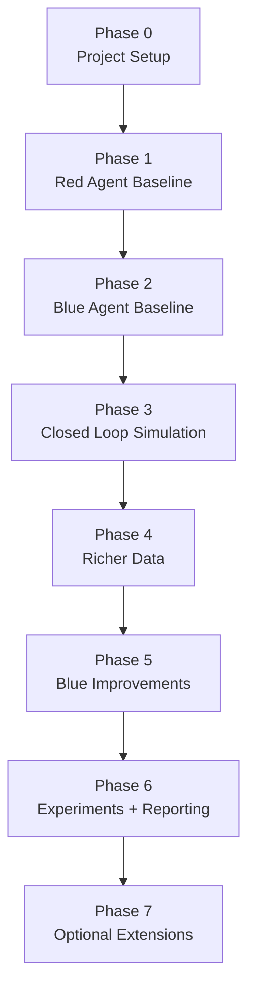

# PRAHAAR – Red/Blue Agent Playground

This repository collects everything for the PRAHAAR project: data, code, documentation, and experiment assets. The focus is a safe, self-contained red-vs-blue loop for phishing-email simulations.

## Repository layout

- `docs/` – background notes such as `project_brief.md` (the original plan you pasted from ChatGPT).
- `src/` – Python packages.
  - `red_agent/` – phishing generation logic.
  - `blue_agent/` – classification/evaluation logic.
  - `common/` – helpers shared by both agents (LLM client, config, metrics).
- `data/` – generated datasets (`raw/`) and cleaned/annotated versions (`processed/`).
- `scripts/` – CLI utilities (dataset generation, evaluation loop, etc.).

## Suggested first steps

1. **Set up the environment**
   - `python3 -m venv .venv && source .venv/bin/activate`
   - `pip install -r requirements.txt`
   - Add an `.env` file with your API key (e.g., `OPENAI_API_KEY=...`).

2. **Implement the minimal Red Agent**
   - Fill in `src/common/llm_client.py` (basic wrapper around your LLM API).
   - Implement `src/red_agent/scenarios.py` with a small catalog of phishing scenarios.
   - Implement `src/red_agent/generator.py` with a `generate_phishing_example` function that:
     1. Accepts `scenario`, `difficulty`, and safety toggles.
     2. Calls the shared LLM client with a safe prompt.
     3. Returns structured data (`dict` with `scenario`, `difficulty`, `body`, `red_flags`).
   - Create `scripts/generate_dataset.py` to loop over scenarios/difficulties and save JSON/CSV in `data/raw/`.

3. **Ship the minimal Blue Agent**
   - Add `src/blue_agent/classifier.py` that loads a dataset entry, asks the LLM for phishing/benign + explanation, and returns predictions.
   - Write `scripts/evaluate_blue_agent.py` that consumes the generated dataset and prints accuracy/precision/recall.

4. **Close the loop**
   - Add `scripts/run_simulation.py` that ties Red + Blue together in one run, logs misses, and dumps metrics for later visualization.

All new code should live under `src/` and import via the package path (e.g., `from red_agent.generator import ...`). Keep documentation in `docs/`, generated artifacts in `data/`, and automation scripts under `scripts/`.

## Profile-aware sending (new)

- `scripts/send_emails.py` generates personalized training emails from a CSV/JSON of targets (columns: `email`, `name`, `role`, `company`, `department`, `interests`, `recent_events`).
- Defaults to **dry-run** and writes `.eml` files under `data/processed/outbox/`. Add `--send` to use SMTP.
- Env vars for delivery: `SMTP_HOST`, `SMTP_PORT` (default 587), `SMTP_USER`, `SMTP_PASS`, `FROM_EMAIL` (default `training@example.com`), optional `SMTP_USE_TLS` (`true` by default).
- Example (Mailtrap sandbox):  
  ```bash
  PYTHONPATH=src OPENAI_API_KEY=... \
  SMTP_HOST=sandbox.smtp.mailtrap.io SMTP_PORT=2525 \
  SMTP_USER=... SMTP_PASS=... FROM_EMAIL="Training Team <training@example.com>" \
  python scripts/send_emails.py targets.csv --scenario salary_slip --difficulty medium --send
  ```
- Adds `Date` and `Message-ID` headers to reduce spam score; logs `[start]`, `[ready]`, `[send]`, `[sent]` (or `[error]`) for visibility.

## Quick run commands

- Environment: `python3 -m venv .venv && source .venv/bin/activate && pip install -r requirements.txt`
- Base env vars (same shell): `export PYTHONPATH=src OPENAI_API_KEY=...`
- Generate dataset (CSV under `data/raw/`): `python scripts/generate_dataset.py --per-scenario 3`
- Run red vs blue simulation: `python scripts/run_simulation.py`
- Evaluate blue agent on a dataset: `python scripts/evaluate_blue_agent.py data/raw/<your_dataset>.csv`
- Send training emails (dry-run): `python scripts/send_emails.py targets.csv --scenario salary_slip --difficulty medium`
- Send via SMTP (Mailtrap sandbox example):  
  `PYTHONPATH=src OPENAI_API_KEY=... SMTP_HOST=sandbox.smtp.mailtrap.io SMTP_PORT=2525 SMTP_USER=... SMTP_PASS=... FROM_EMAIL="Training Team <training@example.com>" python scripts/send_emails.py targets.csv --scenario salary_slip --difficulty medium --send`

## Next actions checklist

- [ ] Create `.env.example` listing required environment variables.
- [ ] Implement `src/common/llm_client.py` (even if it initially uses a dummy template instead of a real API call).
- [ ] Build `scripts/generate_dataset.py` and store the first CSV in `data/raw/`.
- [ ] Draft a `scripts/evaluate_blue_agent.py` skeleton with placeholder evaluation metrics.
- [ ] Record observations/metrics under `docs/experiments/` as you run simulations.

Once these boxes are checked you will have the backbone needed to iterate on smarter agents, add metrics, and write up the experimental results.

## PRAHAAR Workflow Roadmap



| Phase | Focus | Key Tasks |
| --- | --- | --- |
| **0. Project setup** *(done)* | Repo scaffolding | `docs/`, `src/`, `data/` tree, README, requirements, `.env`, shared config & LLM client |
| **1. Red agent baseline** *(done)* | Phishing email generation | Scenario catalog, JSON prompt enforcing `[TRAINING SIMULATION …]`, `scripts/generate_dataset.py` producing CSVs |
| **2. Blue agent baseline** *(done)* | LLM-based phishing classification | `PhishingClassifier`, `scripts/evaluate_blue_agent.py`, basic accuracy |
| **3. Closed-loop simulation** *(done)* | Red vs. Blue logging | `scripts/run_simulation.py`, `data/processed/simulation_log.txt` |
| **4. Richer data** | Harder & benign samples | Add benign templates/generator, attach metadata (sender, domains, attachment info), vary difficulty tactics |
| **5. Blue improvements** | Better defenses | Extend classifier prompt with metadata, add heuristics (domain allow/deny lists, attachment filters), compute precision/recall/confusion matrix |
| **6. Experiments & reporting** | Evidence for final report | Batch runs with different seeds/models, store metrics in `docs/experiments/*.md`, plot detection vs. difficulty, document limitations |
| **7. Optional extensions** | Stretch goals | SMS/voice phishing, simple attack-chain reconstruction, adaptive Red agent that reacts to Blue misses |

Following these phases keeps the project coherent: start with a safe baseline, iterate toward richer simulations and defenses, and capture metrics for the PRAHAAR report.
